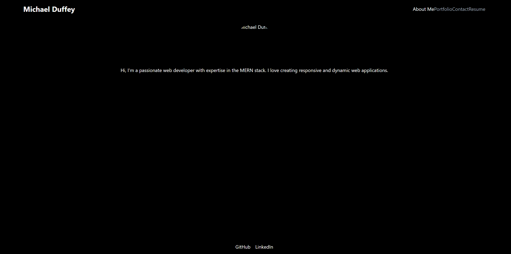

# Personal Portfolio

## Description
This is my own personal portfolio. It will be used to showcase my projects, skills, and contact information

## Table of Contents
- [Installation](#installation)
- [Usage](#usage)
- [Credits](#credits)
- [License](#license)
- [How to Contribute](#how-to-contribute)
- [Tests](#tests)

## Installation
This project does not require an installation. However, you are welcome to to either clone the repository and access the project files or fork the repo.

## Usage
Deployed on [Netlify](https://mtduffey36-portfolio.netlify.app)

## Credits
This was a solo project

## License
MIT License.

## How to Contribute
I are currently not looking for contributors. However any advice is always appreciated. 

## Tests
Tested at the time of deployment.
